<div align="center">

# SuGaR: Surface-Aligned Gaussian Splatting for Efficient 3D Mesh Reconstruction and High-Quality Mesh Rendering

<font size="4">
<a href="https://anttwo.github.io/" style="font-size:100%;">Antoine Guédon</a>&emsp;
<a href="https://vincentlepetit.github.io/" style="font-size:100%;">Vincent Lepetit</a>&emsp;
</font>
<br>

<font size="4">
LIGM, Ecole des Ponts, Univ Gustave Eiffel, CNRS
</font>

| <a href="https://anttwo.github.io/sugar/">Webpage</a> | <a href="https://arxiv.org/abs/2311.12775">arXiv</a> | <a href="https://www.youtube.com/watch?v=MAkFyWfiBQo">Presentation video</a> | <a href="https://www.youtube.com/watch?v=YbjE0wnw67I">Viewer video</a> |

 <br>
<b>Our method extracts meshes from 3D Gaussian Splatting reconstructions and builds hybrid representations <br>that enable easy composition and animation in Gaussian Splatting scenes by manipulating the mesh.</b>
</div>

## Abstract

_We propose a method to allow precise and extremely fast mesh extraction from <a href="https://repo-sam.inria.fr/fungraph/3d-gaussian-splatting/">3D Gaussian Splatting (SIGGRAPH 2023)</a>.
Gaussian Splatting has recently become very popular as it yields realistic rendering while being significantly faster to train than NeRFs. It is however challenging to extract a mesh from the millions of tiny 3D Gaussians as these Gaussians tend to be unorganized after optimization and no method has been proposed so far.
Our first key contribution is a regularization term that encourages the 3D Gaussians to align well with the surface of the scene.
We then introduce a method that exploits this alignment to sample points on the real surface of the scene and extract a mesh from the Gaussians using Poisson reconstruction, which is fast, scalable, and preserves details, in contrast to the Marching Cubes algorithm usually applied to extract meshes from Neural SDFs.
Finally, we introduce an optional refinement strategy that binds Gaussians to the surface of the mesh, and jointly optimizes these Gaussians and the mesh through Gaussian splatting rendering. This enables easy editing, sculpting, rigging, animating, or relighting of the Gaussians using traditional softwares (Blender, Unity, Unreal Engine, etc.) by manipulating the mesh instead of the Gaussians themselves.
Retrieving such an editable mesh for realistic rendering is done within minutes with our method, compared to hours with the state-of-the-art method on neural SDFs, while providing a better rendering quality in terms of PSNR, SSIM and LPIPS._

<div align="center">
<b>Hybrid representation (Mesh + Gaussians on the surface)</b><br>


<br>


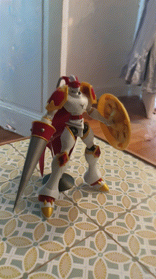<br>
<b>Underlying mesh without texture</b><br>
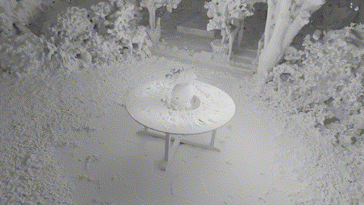
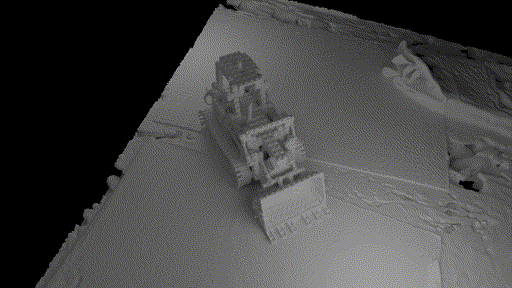
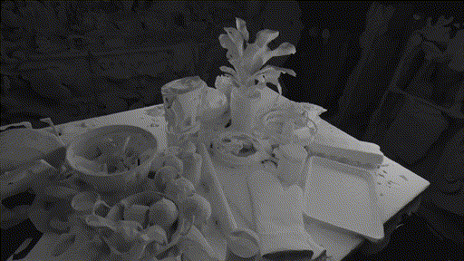<br>
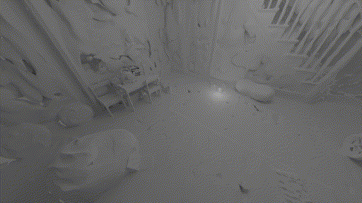
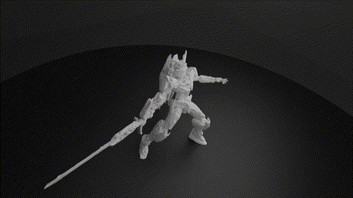
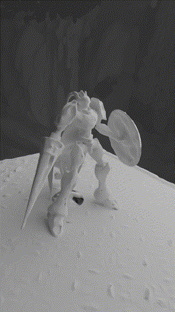<br>
</div>


## BibTeX

```
@article{guedon2023sugar,
  title={SuGaR: Surface-Aligned Gaussian Splatting for Efficient 3D Mesh Reconstruction and High-Quality Mesh Rendering},
  author={Gu{\'e}don, Antoine and Lepetit, Vincent},
  journal={arXiv preprint arXiv:2311.12775},
  year={2023}
}
```

## Updates and To-do list

<details>
<summary><span style="font-weight: bold;">Updates</span></summary>
<ul>
  <li><b>[01/09/2024]</b> Added a dedicated, real-time viewer to let users visualize and navigate in the reconstructed scenes (hybrid representation, textured mesh and wireframe mesh).</li>
  <li><b>[12/20/2023]</b> Added a short notebook showing how to render images with the hybrid representation using the Gaussian Splatting rasterizer.</li>
  <li><b>[12/18/2023]</b> Code release.</li>
</ul>
</details><br>

<details>
<summary><span style="font-weight: bold;">To-do list</span></summary>
<ul>
  <li><b>Improvement:</b> Add an <code>if</code> block to <code>sugar_extractors/coarse_mesh.py</code> to skip foreground mesh reconstruction and avoid triggering an error if no surface point is detected inside the foreground bounding box. This can be useful for users that want to reconstruct "<i>background scenes</i>". </li>
  <li><b>Using precomputed masks with SuGaR:</b> Add a mask functionality to the SuGaR optimization, to allow the user to mask out some pixels in the training images (like white backgrounds in synthetic datasets).
  </li>
  <li><b>Using SuGaR with Windows:</b> Adapt the code to make it compatible with Windows. Due to path-writing conventions, the current code is not compatible with Windows. 
  </li>
  <li><b>Synthetic datasets:</b> Add the possibility to use the NeRF synthetic dataset (which has a different format than COLMAP scenes)
  </li>
  <li><b>Composition and animation:</b> Finish to clean the code for composition and animation, and add it to the <code>sugar_scene/sugar_compositor.py</code> script.
  </li>
  <li><b>Composition and animation:</b> Make a tutorial on how to use the scripts in the <code>blender</code> directory and the <code>sugar_scene/sugar_compositor.py</code> class to import composition and animation data into PyTorch and apply it to the SuGaR hybrid representation.
  </li>
  <!-- <li><b>Improvement:</b> Implement a simple method to avoid artifacts when reconstructing thin objects with poor coverage/visibility in the training images.</li>
  </li> -->
</ul>
</details>

## Overview

As we explain in the paper, SuGaR optimization starts with first optimizing a 3D Gaussian Splatting model for 7k iterations with no additional regularization term. 
In this sense, SuGaR is a method that can be applied on top of any 3D Gaussian Splatting model, and a Gaussian Splatting model optimized for 7k iterations must be provided to SuGaR.

Consequently, the current implementation contains a version of the original <a href="https://github.com/graphdeco-inria/gaussian-splatting">3D Gaussian Splatting code</a>, and we built our model as a wrapper of a vanilla 3D Gaussian Splatting model.
Please note that, even though this wrapper implementation is convenient for many reasons, it may not be the most optimal one for memory usage, so we might change it in the future.

After optimizing a vanilla Gaussian Splatting model, the SuGaR pipeline consists of 3 main steps, and an optional one:
1. **SuGaR optimization**: optimizing Gaussians alignment with the surface of the scene
2. **Mesh extraction**: extracting a mesh from the optimized Gaussians
3. **SuGaR refinement**: refining the Gaussians and the mesh together to build a hybrid representation
4. **Textured mesh extraction (Optional)**: extracting a traditional textured mesh from the refined SuGaR model

<div align="center"><br>
<br>
<br>
</div><br>

We provide a dedicated script for each of these steps, as well as a script `train.py` that runs the entire pipeline. We explain how to use this script in the next sections. <br>

Please note that the final step, _Textured mesh extraction_, is optional but is enabled by default in the `train.py` script. Indeed, it is very convenient to have a traditional textured mesh for visualization, composition and animation using traditional softwares such as Blender. However, this step is not needed to produce, modify or animate hybrid representations.

<div align="center">
<b>Hybrid representation (Mesh + Gaussians on the surface)</b><br>
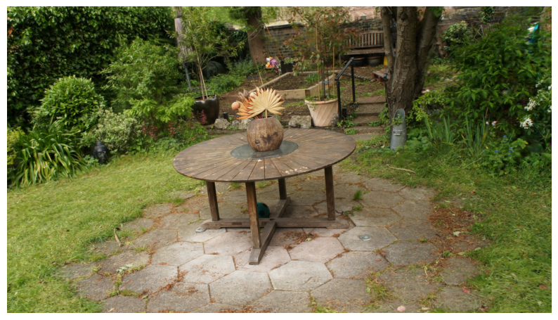
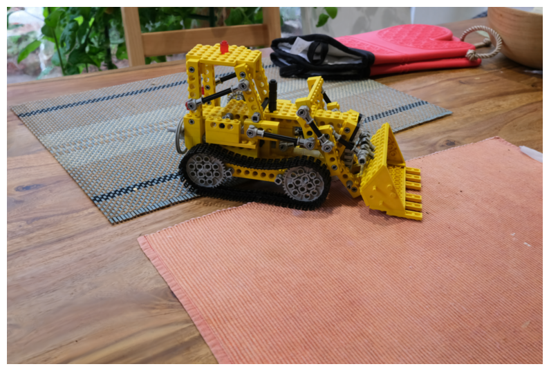
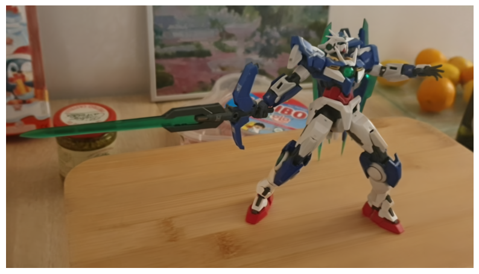
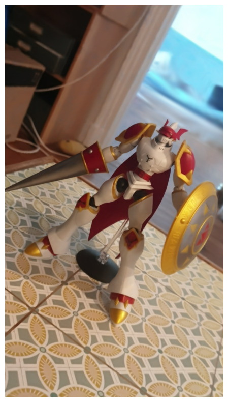<br>
<b>Underlying mesh with a traditional colored UV texture</b><br>
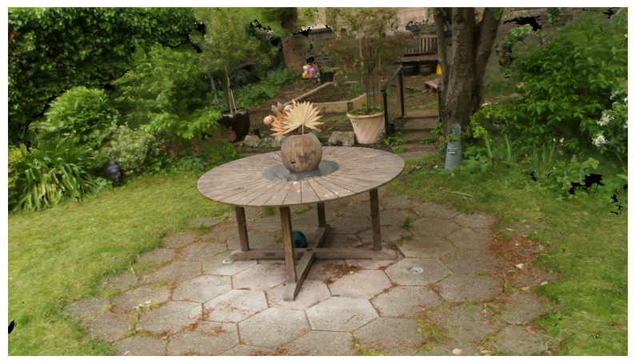
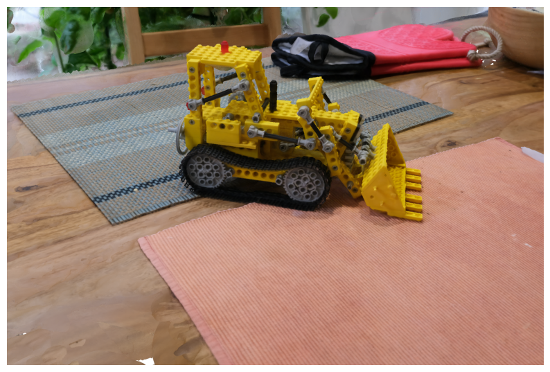
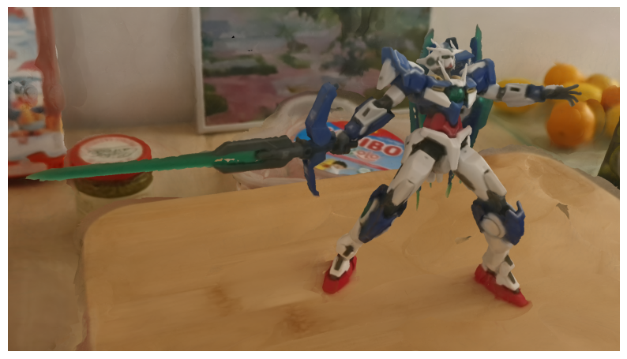
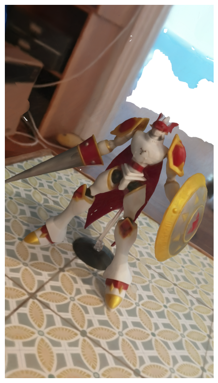<br>
</div><br>

Below is another example of a scene showing a robot with a black and specular material. The following images display the hybrid representation (Mesh + Gaussians on the surface), the mesh with a traditional colored UV texture, and a depth map of the mesh:
<div align="center">
<b>Hybrid representation - Textured mesh - Depth map of the mesh</b><br>
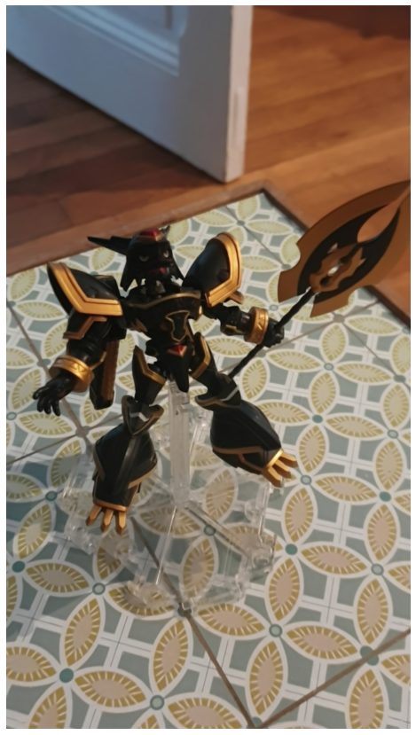


</div>

## Installation

### 0. Requirements

The software requirements are the following:
- Conda (recommended for easy setup)
- C++ Compiler for PyTorch extensions
- CUDA toolkit 11.8 for PyTorch extensions
- C++ Compiler and CUDA SDK must be compatible

Please refer to the original <a href="https://github.com/graphdeco-inria/gaussian-splatting">3D Gaussian Splatting repository</a> for more details about requirements.

### 1. Clone the repository

Start by cloning this repository:

```shell
# HTTPS
git clone https://github.com/Anttwo/SuGaR.git --recursive
```

or

```shell
# SSH
git clone git@github.com:Anttwo/SuGaR.git --recursive
```

### 2. Install the required Python packages
To install the required Python packages and activate the environment, go inside the `SuGaR/` directory and run the following commands:

```shell
conda env create -f environment.yml
conda activate sugar
```

<details>
<summary><span style="font-weight: bold;">If this command fails to create a working environment</span></summary>

Then you can try to install the required packages manually by running the following commands:
```shell
conda create --name sugar -y python=3.9
conda activate sugar
conda install pytorch==2.0.1 torchvision==0.15.2 torchaudio==2.0.2 pytorch-cuda=11.8 -c pytorch -c nvidia
conda install -c fvcore -c iopath -c conda-forge fvcore iopath
conda install pytorch3d==0.7.4 -c pytorch3d
conda install -c plotly plotly
conda install -c conda-forge rich
conda install -c conda-forge plyfile==0.8.1
conda install -c conda-forge jupyterlab
conda install -c conda-forge nodejs
conda install -c conda-forge ipywidgets
pip install open3d
pip install --upgrade PyMCubes
```
</details>

### 3. Install the Gaussian Splatting rasterizer

Run the following commands inside the sugar directory to install the additional Python submodules required for Gaussian Splatting:

```shell
cd gaussian_splatting/submodules/diff-gaussian-rasterization/
pip install -e .
cd ../simple-knn/
pip install -e .
cd ../../../
```
Please refer to the <a href="https://github.com/graphdeco-inria/gaussian-splatting">3D Gaussian Splatting repository</a> for more details.


## Quick Start

Start by optimizing a vanilla Gaussian Splatting model for 7k iterations by running the script `gaussian_splatting/train.py`, as shown below. Please refer to the original <a href="https://github.com/graphdeco-inria/gaussian-splatting">3D Gaussian Splatting repository</a> for more details. This optimization should be very fast, and last only a few minutes.

```shell
python gaussian_splatting/train.py -s <path to COLMAP dataset> --iterations 7000 -m <path to the desired output directory>
```

Then, run the script `train.py` in the root directory to optimize a SuGaR model.

```shell
python train.py -s <path to COLMAP dataset> -c <path to the Gaussian Splatting checkpoint> -r <"density" or "sdf">
```

The most important arguments for the `train.py` script are the following:
| Parameter | Type | Description |
| :-------: | :--: | :---------: |
| `--scene_path` / `-s`   | `str` | Path to the source directory containing a COLMAP dataset.|
| `--checkpoint_path` / `-c` | `str` | Path to the checkpoint directory of the vanilla 3D Gaussian Splatting model. |
| `--regularization_type` / `-r` | `str` | Type of regularization to use for optimizing SuGaR. Can be `"density"` or `"sdf"`. For reconstructing detailed objects centered in the scene with 360° coverage, `"density"` provides a better foreground mesh. For a stronger regularization and a better balance between foreground and background, choose `"sdf"`. |
| `--eval` | `bool` | If True, performs an evaluation split of the training images. Default is `True`. |
| `--low_poly` | `bool` | If True, uses the standard config for a low poly mesh, with `200_000` vertices and `6` Gaussians per triangle. |
| `--high_poly` | `bool` | If True, uses the standard config for a high poly mesh, with `1_000_000` vertices and `1` Gaussian per triangle. |
| `--refinement_time` | `str` | Default configs for time to spend on refinement. Can be `"short"` (2k iterations), `"medium"` (7k iterations) or `"long"` (15k iterations). |
| `--export_uv_textured_mesh` / `-t` | `bool` | If True, will optimize and export a traditional textured mesh as an `.obj` file from the refined SuGaR model, after refinement. Computing a traditional color UV texture should take less than 10 minutes. Default is `True`. |
| `--export_ply` | `bool` | If True, export a `.ply` file with the refined 3D Gaussians at the end of the training. This file can be large (+/- 500MB), but is needed for using the dedicated viewer. Default is `True`. |

We provide more details about the two regularization methods `"density"` and `"sdf"` in the next section. For reconstructing detailed objects centered in the scene with 360° coverage, `"density"` provides a better foreground mesh. For a stronger regularization and a better balance between foreground and background, choose `"sdf"`. <br>
The default configuration is `high_poly` with `refinement_time` set to `"long"`. Results are saved in the `output/` directory.<br>

As we explain in the paper, this script extracts a mesh in 30~35 minutes on average on a single GPU. After mesh extraction, the refinement time only takes a few minutes when using `--refinement_time "short"`, but can take up to an hour when using `--refinement_time "long"`. A short refinement time is enough to produce a good-looking hybrid representation in most cases.

Please note that the optimization time may vary (from 20 to 45 minutes) depending on the complexity of the scene and the GPU used. Moreover, the current implementation splits the optimization into 3 scripts that can be run separately (SuGaR optimization, mesh extraction, model refinement) so it reloads the data at each part, which is not optimal and takes several minutes. We will update the code in a near future to optimize this.

Below is a detailed list of all the command line arguments for the `train.py` script.
<details>
<summary><span style="font-weight: bold;">All command line arguments for train.py</span></summary>

#### Data and initial 3D Gaussian Splatting optimization

| Parameter | Type | Description |
| :-------: | :--: | :---------: |
| `--scene_path` / `-s`   | `str` | Path to the source directory containing a COLMAP data set.|
| `--checkpoint_path` / `-c` | `str` | Path to the checkpoint directory of the vanilla 3D Gaussian Splatting model. |
| `--iteration_to_load` / `-i` | `int` | Iteration to load from the 3DGS checkpoint directory. If not specified, loads the iteration `7000`. |
| `--eval` | `bool` | If True, performs an evaluation split of the training images. Default is `True`. |

#### SuGaR optimization
| Parameter | Type | Description |
| :-------: | :--: | :---------: |
| `--regularization_type` / `-r` | `str` | Type of regularization to use for optimizing SuGaR. Can be `"density"` or `"sdf"`. |
| `--gpu` | `int` | Index of GPU device to use. Default is `0`. |

#### Mesh extraction

| Parameter | Type | Description |
| :-------: | :--: | :---------: |
| `--surface_level` / `-l` |`int`| Surface level to extract the mesh at. Default is `0.3`. |
| `--n_vertices_in_mesh` / `-v` | `int` | Number of vertices in the extracted mesh. Default is `1_000_000`. |
| `--bboxmin` / `-b` | `str` | Min coordinates to use for foreground bounding box, formatted as a string `"(x,y,z)"`.|
| `--bboxmax` / `-B` | `str` | Max coordinates to use for foreground bounding box, formatted as a string `"(x,y,z)"`. |
| `--center_bbox` | `bool` | If True, centers the bbox. Default is True. |

#### SuGaR and mesh refinement (Hybrid representation)

| Parameter | Type | Description |
| :-------: | :--: | :---------: |
| `--gaussians_per_triangle` / `-g` | `int` | Number of gaussians per triangle. Default is `1`. |
| `--refinement_iterations` / `-f` | `int` | Number of refinement iterations. Default is `15_000`. |    

#### (Optional) Parameters for traditional textured mesh extraction

| Parameter | Type | Description |
| :-------: | :--: | :---------: |
| `--export_uv_textured_mesh` / `-t` | `bool` | If True, will optimize and export a textured mesh as an .obj file from the refined SuGaR model. Computing a traditional colored UV texture should take less than 10 minutes. Default is `True`. |
| `--square_size` | `int` | Size of the square to use for the UV texture. Default is `10`. |
| `--postprocess_mesh` | `bool` | If True, postprocess the mesh by removing border triangles with low-density. This step takes a few minutes and is not needed in general, as it can also be risky. However, it increases the quality of the mesh in some cases, especially when very thin objects are visible only from one side in the images. Default is `False`. |
| `--postprocess_density_threshold` | `float` | Threshold to use for postprocessing the mesh. Default is `0.1`. |
| `--postprocess_iterations` | `int` | Number of iterations to use for postprocessing the mesh. Default is `5`. |

#### (Optional) Parameters for exporting PLY files for the dedicated viewer

| Parameter | Type | Description |
| :-------: | :--: | :---------: |
| `--export_ply` | `bool` | If True, export a `.ply` file with the refined 3D Gaussians at the end of the training. This file can be large (+/- 500MB), but is needed for using the dedicated viewer. Default is `True`. |

#### (Optional) Default configurations

| Parameter | Type | Description |
| :-------: | :--: | :---------: |
| `--low_poly` | `bool` | If True, uses standard config for a low poly mesh, with `200_000` vertices and `6` Gaussians per triangle. |
| `--high_poly` | `bool` | If True, uses standard config for a high poly mesh, with `1_000_000` vertices and `1` Gaussians per triangle. |
| `--refinement_time` | `str` | Default configs for time to spend on refinement. Can be `"short"` (2k iterations), `"medium"` (7k iterations) or `"long"` (15k iterations). |

</details>


## Installing and using the real-time viewer

Please find <a href="https://www.youtube.com/watch?v=YbjE0wnw67I">here</a> a short video illustrating how to use the viewer.

### 1. Installation

*The viewer is currently built for Linux and Mac OS. It is not compatible with Windows. For Windows users, we recommend to use WSL2 (Windows Subsystem for Linux), as it is very easy to install and use. Please refer to the <a href="https://docs.microsoft.com/en-us/windows/wsl/install-win10">official documentation</a> for more details.<br> We thank <a href="https://github.com/mkkellogg/GaussianSplats3D">Mark Kellogg for his awesome 3D Gaussian Splatting implementation for Three.js</a>, which we used for building this viewer.*

Please start by installing the latest versions of Node.js (such as 21.x) and npm.
A simple way to do this is to run the following commands (using aptitude):

```shell
curl -fsSL https://deb.nodesource.com/setup_21.x | sudo -E bash -
sudo apt-get install -y nodejs
sudo apt-get install aptitude
sudo aptitude install -y npm
```

Then, go inside the `./sugar_viewer/` directory and run the following commands:

```shell
npm install
cd ..
```

### 2. Usage

First, make sure you have exported a `.ply` file and an `.obj` file using the `train.py` script. The `.ply` file contains the refined 3D Gaussians, and the `.obj` file contains the textured mesh. These files are exported by default when running the `train.py` script, so if you ran the code with default values for `--export_ply` and `--export_uv_textured_mesh`, you should be good to go.

The ply file should be located in `./output/refined_ply/<your scene name>/`. Then, just run the following command in the root directory to start the viewer:

```shell
python run_viewer.py -p <path to the .ply file>
```
Please make sure your `.ply` file is located in the right folder, and use a relative path starting with `./output/refined_ply`.
This command will redirect you to a local URL. Click on the link to open the viewer in your browser. Click the icons on the top right to switch between the different representations (hybrid representation, textured mesh, wireframe mesh). Use the mouse to rotate the scene, and the mouse wheel to zoom in and out. 

<div align="center" >
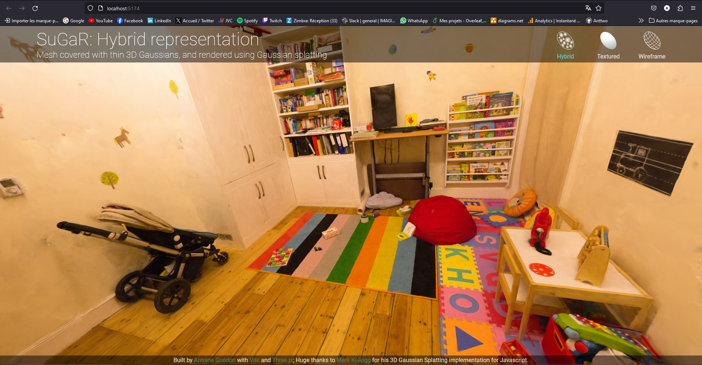
</div><br>

## Tips for using SuGaR on your own data and obtain better reconstructions

### 1. Capture images or videos that cover the entire surface of the scene

Using a smartphone or a camera, capture images or a video that cover the entire surface of the 3D scene you want to reconstruct. The easiest way to do this is to move around the scene while recording a video. Try to move slowly and smoothly in order to avoid motion blur. For consistent reconstruction and easier camera pose estimation with COLMAP, maintaining a uniform focal length and a constant exposure time is also important. We recommend to disable auto-focus on your smartphone to ensure that the focal length remains constant.

For better reconstructions, try to cover objects from several and different angles, especially for thin and detailed parts of the scene. 
Indeed, SuGaR is able to reconstruct very thin and detailed objects, but some artifacts may appear if these thin objects are not covered enough and are visible only from one side in the training images.

<details>
<summary><span style="font-weight: bold;">Detailed explanation</span></summary>
SuGaR applies Poisson reconstruction with 3D points sampled on the parts of the surface that are visible in the training images. This visibility constraint is important to prevent sampling points on the backside of the Gaussian level sets, located behind the surface of the scene, which would produce a lot of self-collisions and many unnecessary vertices in the mesh after applying Poisson reconstruction.
However, this visibility constraint also means that SuGaR cannot reconstruct parts of the surface that are not visible in the training images. If thin objects are visible only from one side in the training images, the Poisson reconstruction will try to reconstruct a closed surface, and will extend the surface of the thin objects, which produces an inaccurate mesh.

_TODO: Add images illustrating such artifacts._
</details><br>

However, such artifacts are not visible in the hybrid representation, because the gaussian texturing gives low-opacity to these artifacts during refinement. 

We already have simple ideas that could help to avoid such artifacts, such as **(a)** identifying new camera poses that cover parts of the surface non-visible in the training images that are likely to be on the same level set as the visible parts, and **(b)** adding these camera poses to the set of cameras used for sampling the points when applying Poisson reconstruction. We will update the code in a near future to include this.

To convert a video to images, you can install `ffmpeg` and run the following command:
```shell
ffmpeg -i <Path to the video file> -qscale:v 1 -qmin 1 -vf fps=<FPS> %04d.jpg
```
where `<FPS>` is the desired sampling rate of the video images. An FPS value of 1 corresponds to sampling one image per second. We recommend to adjust the sampling rate to the length of the video, so that the number of sampled images is between 100 and 300.

### 2. Estimate camera poses with COLMAP

Please first install a recent version of COLMAP (ideally CUDA-powered) and make sure to put the images you want to use in a directory `<location>/input`. Then, run the script `gaussian_splatting/convert.py` from the original Gaussian splatting implementation to compute the camera poses from the images using COLMAP. Please refer to the original <a href="https://github.com/graphdeco-inria/gaussian-splatting">3D Gaussian Splatting repository</a> for more details.

```shell
python gaussian_splatting/convert.py -s <location>
```

Sometimes COLMAP fails to reconstruct all images into the same model and hence produces multiple sub-models. The smaller sub-models generally contain only a few images. However, by default, the script `convert.py` will apply Image Undistortion only on the first sub-model, which may contain only a few images.

If this is the case, a simple solution is to keep only the largest sub-model and discard the others. To do this, open the source directory containing your input images, then open the sub-directory `<Source_directory>/distorted/sparse/`. You should see several sub-directories named `0/`, `1/`, etc., each containing a sub-model. Remove all sub-directories except the one containing the largest files, and rename it to `0/`. Then, run the script `convert.py` one more time but skip the matching process:

```shell
python gaussian_splatting/convert.py -s <location> --skip_matching
```

_Note: If the sub-models have common registered images, they could be merged into a single model as post-processing step using COLMAP; However, merging sub-models requires to run another global bundle adjustment after the merge, which can be time consuming._


### 3. Density or SDF? Choose a regularization method that fits your scene

As we explain in the paper, we provide two separate regularization methods for SuGaR: a density regularization and an SDF regularization. The density regularization is the simplest one and works well with objects centered in the scene. The SDF provides a stronger regularization, especially in background regions. 
As a consequence, the SDF regularization produces higher metrics on standard datasets. 
However, for reconstructing an object centered in the scene with images taken from all around the object, the simpler density regularization generally produces a better mesh.

Therefore, we recommend the following when using the `train.py` script:
- For reconstructing detailed objects centered in the scene with 360° coverage (such as the toys we reconstructed in our presentation video), start with the density regularization `-r 'density'`. However, this may result in more chaotic Gaussians in the background.
- For reconstructing more challenging scenes or enforcing a stronger regularization in the background, use the SDF regularization `-r 'sdf'`.

### 4. (Optional) Adapt the scale and the bounding box of the scene

As it is explained in the original <a href="https://github.com/graphdeco-inria/gaussian-splatting">3D Gaussian Splatting repository</a>, the method is expected to reconstruct a scene with reasonable scale. For reconstructing much larger datasets, like a city district, the original authors recommend to lower the learning rates of the positions and scaling factors of the Gaussians. The more extensive the scene, the lower these values should be.

Concerning SuGaR, such learning rates should also be lowered when reconstructing a very large scene. Moreover, as we explain in the supplementary material of the paper, for extracting a mesh from the Gaussians with an optimal repartition of vertices, we apply two Poisson reconstructions in practice: one on _foreground_ Gaussians, and one on _background_ Gaussians. The foreground Gaussians are defined as the Gaussians located inside a predefined bounding box, and the background Gaussians are defined as the Gaussians located outside this bounding box. 

By default, this bounding box is computed as the bounding box of all camera centers. This general approach is coherent with how the original 3D Gaussian Splatting scales the learning rates. We used this default bounding box for all the reconstructions shown in the paper and the presentation video.

However, this bounding box might not be optimal in very specific cases, especially when the user wants to reconstruct with high details a very specific object located somewhere in the scene, or if the scene is very large, or if the camera centers are very far from the scene.
The user is free to provide a custom bounding box to the `train.py` script, using the parameters `--bboxmin` and `--bboxmax`. Please note that the bounding box must be provided as strings, formatted as `"(x,y,z)"`, where `x`, `y` and `z` are the coordinates of the min and max points of the bounding box.


## Rendering, composition and animation

The `view_sugar_results.ipynb` notebook and the `metrics.py` script provides examples of how to load a refined SuGaR model for rendering a scene with the hybrid representation and the Gaussian Splatting rasterizer. We will add more details about this in a near future.

We also provide in the `blender` directory several python scripts to export from Blender composition and animation data of SuGaR meshes modified or animated within Blender. Additionally, we provide in the `sugar_scene/sugar_compositor.py` script a Python class that can be used to import such animation or composition data into PyTorch and apply it to the SuGaR hybrid representation. 

The hybrid representation allows for high-quality rendering of the scene with the Gaussian Splatting rasterizer, as shown below.<br>

<div align="center" >

</div><br>

The usage of these scripts and class may be a bit tricky, so we will add a detailed tutorial on how to use them in a near future.


## Evaluation

To evaluate the quality of the reconstructions, we provide a script `metrics.py` that computes the PSNR, SSIM and LPIPS metrics on test images. Start by optimizing SuGaR models for the desired scenes and a regularization method (`"density"` or `"sdf"`), then create a `.json` config file containing the paths to the scenes in the following format: `{source_images_dir_path: vanilla_gaussian_splatting_checkpoint_path}`.

Finally, run the script as follows:

```shell
python metrics.py --scene_config <Path to the .json file> -r <"sdf" or "density"> 
```

Results are saved in a `.json` file in the `output/metrics/` directory. 
Please refer to the script for more details on the command line arguments.